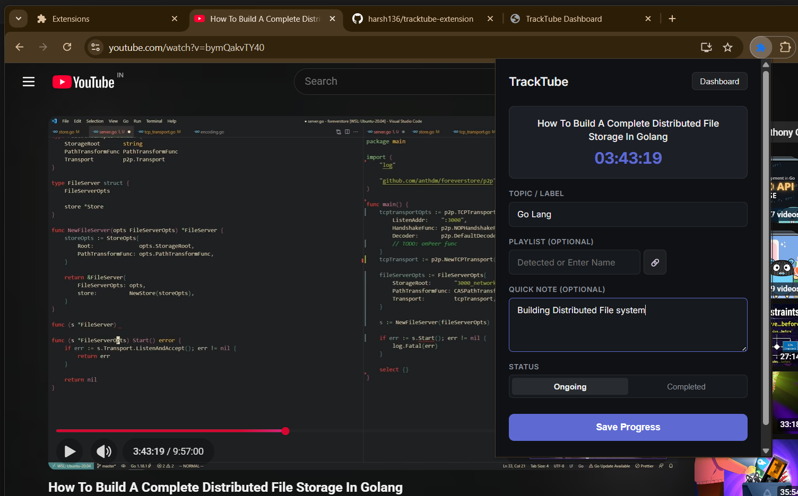

# TrackTube - Smart YouTube Learning Tracker 🎓📺

  

**TrackTube** is a powerful Chrome Extension designed to transform YouTube into a serious learning platform. It allows you to track your progress on educational videos, bookmark specific timestamps with notes, manage courses (playlists), and view comprehensive learning statistics—all from a dedicated dashboard.

---

## 📸 Preview

### Extension Popup

*Quickly save progress, add topics, and take notes while watching.*


### Learning Dashboard

*Visual overview of your tracked videos, courses, and notes.*


---

## ✨ Features

* **⏱️ Smart Progress Tracking**: Automatically saves your timestamp. Resume exactly where you left off.
* **📝 Timestamped Notes**: Take quick notes at specific moments in the video. Jump back to that context with one click.
* **📂 Playlist & Course Management**: Automatically detects YouTube playlists and organizes them as "Courses" in your dashboard.
* **📊 Dedicated Dashboard**: A beautiful, dark-mode interface to view tracked videos, filter by status (Ongoing/Completed), and search by topic.
* **🏷️ Topic Organization**: Tag videos with topics (e.g., "React Hooks", "DBMS") for easy filtering.
* **💾 Data Portability**: Import and Export your learning data (JSON) to backup or sync across devices.
* **🔔 Inactivity Reminders**: Get notified if you have "Ongoing" videos you haven't watched in 24 hours.
* **🔒 Privacy Focused**: All data is stored in your browser's local sync storage. No external servers.

---

## 🛠️ Installation (Local Setup)

Since this extension is in development or used locally, you need to load it as an "Unpacked Extension" in Chrome.

### Prerequisites

* Google Chrome (or a Chromium-based browser like Brave/Edge)
* Git (optional, for cloning)

### Steps

1. **Clone the Repository**

    ```bash
    git clone https://github.com/harsh136/tracktube-extension.git
    cd tracktube-extension
    ```

    *Or simply download the source code as a ZIP file and extract it.*

2. **Open Extension Management**
    * Open Chrome.
    * Navigate to `chrome://extensions/` in the address bar.

3. **Enable Developer Mode**
    * Toggle the **Developer mode** switch in the top-right corner of the page.

4. **Load the Extension**
    * Click the **Load unpacked** button (top-left).
    * Select the folder where you cloned/extracted this repository (ensure it's the folder containing `manifest.json`).

5. **Pin It**
    * Click the puzzle piece icon in your Chrome toolbar and pin **TrackTube**.

---

## 🚀 How to Use

1. **Start Watching**: Open any YouTube video.
2. **Track It**: Click the TrackTube icon in the toolbar.
    * **Topic**: Enter a subject label (e.g., "Python").
    * **Playlist**: If the video is part of a playlist, it's detected automatically.
    * **Note**: Type a note and click "Save Progress".
3. **Resume**: Later, open the extension or dashboard to click "Resume" and jump straight to your saved timestamp.
4. **Dashboard**: Click the **"Dashboard"** button in the popup to view your full learning history, manage notes, and export data.

---

## 🏗️ Tech Stack

* **Frontend**: HTML5, CSS3 (Variables, Flexbox/Grid), JavaScript (ES6+)
* **Framework**: Vanilla JS (No heavy framework overhead)
* **Chrome API**:
  * `storage.sync` (Data persistence)
  * `runtime` & `tabs` (Communication between background/content scripts)
  * `alarms` & `notifications` (Reminders)
* **Design**: Custom dark theme with Inter font family.

---

## 📂 Project Structure

```text
tracktube-extension/
├── manifest.json       # Extension configuration (MV3)
├── background.js       # Background service worker (Alarms, Auto-save)
├── contentScript.js    # DOM manipulation on YouTube (Video details extraction)
├── popup.html          # Extension popup UI
├── popup.js            # Popup logic
├── popup.css           # Popup styling
├── dashboard.html      # Full-page Dashboard UI
├── dashboard.js        # Dashboard logic (Rendering, Filtering, Import/Export)
├── dashboard.css       # Dashboard styling
├── icons/              # App icons
└── preview/            # Preview images for README
